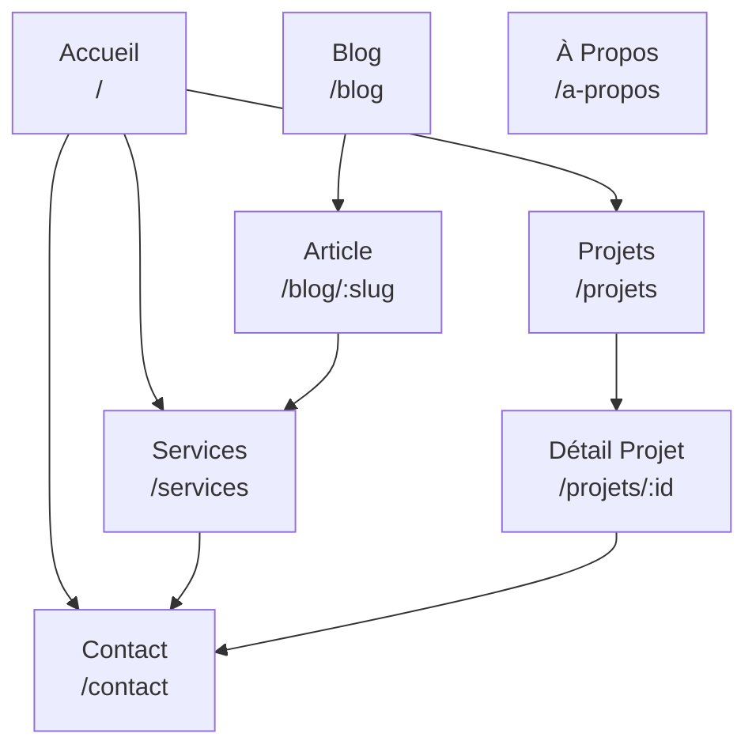

# User Flow — Site Web MAC

```mermaid
graph TD
  %% Pages Principales (accessibles depuis la navigation principale)
  Home["Accueil<br/>/"]
  Services["Services<br/>/services"]
  Projets["Projets<br/>/projets"]
  Blog["Blog<br/>/blog"]
  About["À Propos<br/>/a-propos"]
  Contact["Contact<br/>/contact"]

  %% Navigation depuis l'Accueil
  Home --> Services
  Home --> Projets
  Home --> Contact

  %% Pages de détail - Projets
  Projets --> ProjetDetail["Détail Projet<br/>/projets/:id"]

  %% Pages de détail - Blog
  Blog --> ArticleDetail["Article<br/>/blog/:slug"]

  %% Navigation croisée
  Services --> Contact
  ProjetDetail --> Contact
  ArticleDetail --> Services
```
